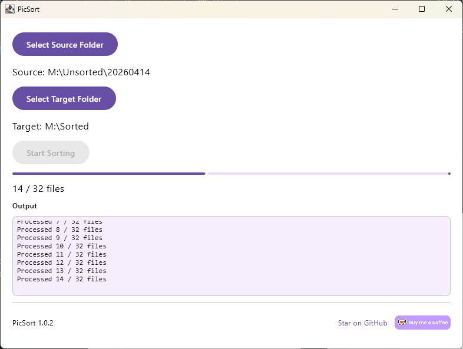

# PicSort

**Your photos. Your computer. Nothing leaves.**

PicSort organizes your photos and videos into clean, date-based folders using EXIF and file metadata. It runs entirely on your machine — no cloud uploads, no accounts, no AI scanning your family photos, no data leaving your computer. Ever.

---

## Why PicSort?

Every major photo organizer wants your pictures in their cloud. Google Photos scans them for AI training. Apple locks them in iCloud. Amazon wants them on their servers.

PicSort doesn't want your photos. It just sorts them.

- **Fully offline** — no internet connection needed
- **No accounts** — no sign-up, no login, no tracking
- **No AI** — no facial recognition, no content analysis, no "smart" features that phone home
- **Open source (MIT)** — inspect every line, fork it, improve it

If you care about digital privacy, your photo library shouldn't live on someone else's server.

---

## What It Does

Point PicSort at a folder of unsorted photos and videos. It reads the metadata timestamps and copies everything into a clean structure:

```
target/
├── pictures/
│   ├── 2024/
│   │   ├── 2024-01-15/
│   │   │   ├── IMG_0042.jpg
│   │   │   └── IMG_0043.heic
│   │   └── 2024-03-22/
│   │       └── vacation.jpg
│   └── 2025/
│       └── 2025-06-01/
│           └── birthday.heic
├── video/
│   └── 2024/
│       └── 2024-07-04/
│           └── fireworks.mp4
└── other/
    └── screenshot.png
```

- Reads EXIF data (photos) and QuickTime/MP4 metadata (videos) for accurate dates
- Handles duplicates automatically with `_1`, `_2` suffixes
- Files without valid date metadata go to `other/`
- Processes files concurrently for speed
- Logs everything to `sorter.log`

---

## Supported Formats

| Category | Formats | Date Sorting |
|----------|---------|:------------:|
| Photos | JPEG, HEIC, HEIF | ✅ Via EXIF |
| Video | MP4, MOV, MPEG | ✅ Via metadata |
| Raw | CR2, NEF, RW2 | 📁 Copied to `other/` |
| Other images | PNG, GIF, BMP, WebP, AVIF | 📁 Copied to `other/` |
| Other video | AVI, WMV, FLV, 3GP, M2TS, M4V, MTS | 📁 Copied to `other/` |

---

## Getting Started

### Requirements

- **JDK 25** or later

### Build

```bash
./gradlew build
```

Produces two JARs in `build/libs/`:
- `picsort-cli-1.0.2.jar` — command-line interface
- `picsort-gui-1.0.2.jar` — desktop GUI

### GUI

```bash
java -jar build/libs/picsort-gui-1.0.2.jar
```

Pick your source and target folders, hit sort, and watch the progress bar and live output log.



### CLI

```bash
java -jar build/libs/picsort-cli-1.0.2.jar /path/to/photos /path/to/sorted
```

---

## Tech Stack

- **Kotlin** with coroutines for concurrent file processing
- **Compose Multiplatform** (Material 3) for the desktop GUI
- **metadata-extractor** for EXIF/video metadata parsing
- **FileKit** for native OS file dialogs

---

## Contributing

Contributions welcome. Open an issue first for anything non-trivial.

---

## Support the Project

PicSort is free and open source. If it saved you some time, consider buying me a coffee.

[](https://ko-fi.com/ngusev)

---

## License

This project is licensed under the **MIT License**. See the [LICENSE](LICENSE) file for details.

You're free to use, modify, and distribute PicSort — including in commercial or closed-source projects. Just keep the copyright notice.
